# OFFICIAL DUBLIN FOOD HITLIST 😱🔥😫🍴  <!-- {docsify-ignore} -->

  

The following list presents an assessment of dining establishments and culinary offerings in Dublin, appraised on a scale of 1 to 10. This evaluation encompasses factors such as taste, portion size, pricing, and other pertinent criteria. Please note that establishments lacking a rating are currently on our list for future visits and assessments.

If you'd like to make an addition to this list, please read the [contributing documentation](CONTRIBUTING.md).

## THE LIST <!-- {docsify-ignore} -->

### OH!MY STREET FOOD (7/10)
Xian burger is pretty good, over priced now. Spice bags are very nice too but just not worth the price anymore.

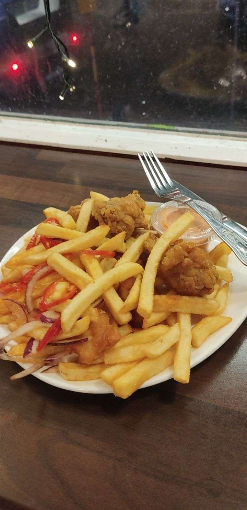
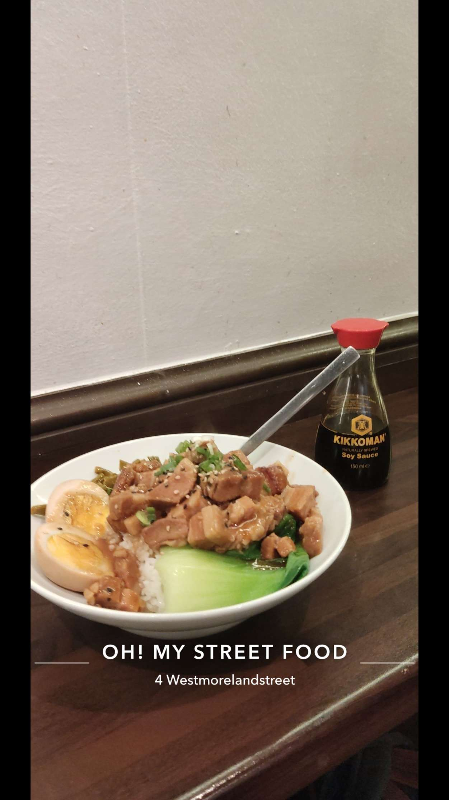

### Wing's World Cuisine (6.3/10)
Decent buffet in the city center. Dinner is better than lunch, more variety and seems fresher. Hashbrowns are very good.

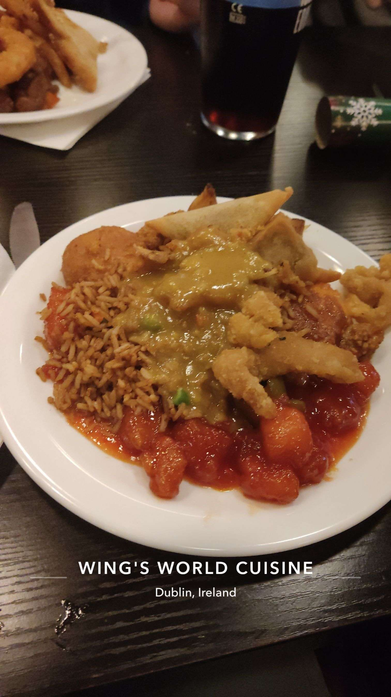

### Charlies 3 (6.75/10)
Decent spice bag.

### Fasta (4.5/10)
Kinda mid, venue is nice though. Just found out this place is permanently closed rip.

### Wowburger (7.3/10)
Good burgers, nice student deal. The wowburger near grafton street opposite Brown Thomas over cook the fries though. Atmosphere in all there locations are nice.

### Star Pizza (8.1/10)
Nice little pizza and burger place in on talbot street. All day special goes hard, worth the price. 

### Gala (deprecated 😢) (8/10)
€2.50 mini spice box slapped. It is now unfortunately €3 something, honestly very upsetting.

### Wok on Inn (7/10)
Very nice spicy box, big portion. However do NOT get it past like 10pm, they just chuck random stuff in there and for this reason they have gotten a lower score.

### Xian Street Food (7.2/10)
Staple place for a spice bag, some may say the best place for a spicy bag. Portions are good, sometimes a bit too salty though so maybe ask for less salt.

### Krewe (7.2/10)
Decent

### Tesco €1 Denny's Hot To Go meals (deprecated 😢) (8.2/10)
This one really breaks my heart. This use to be such a go to until they raised their prices. I don't really blame them honestly it was too good to be true, good while it lasted.

### Pasaeno (7/10)
Cheap food - not bad, would rather go star pizza though.

### Mad Egg (8.3/10)
Very nice place if you like chicken burgers. The GOAT burger is the best in my opinion. Cheesecakes there are also very good.

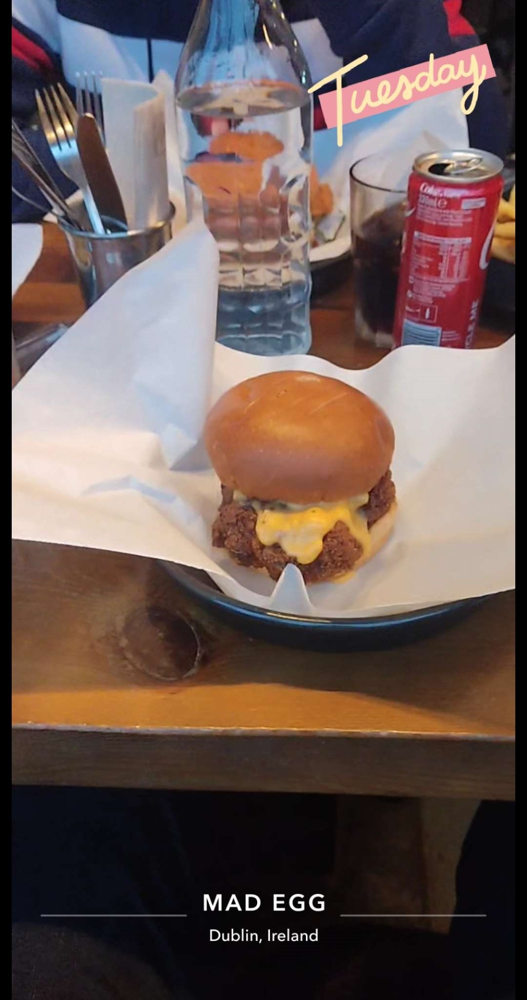

### Gaucho's Dog (8.73/10)
Very good place, best hot dogs in Dublin from what I know. Unfortunately they closed the one on tara street.

### Arisu (7.7/10)
Nice Korean food, big portions, bit pricey.

### Pizza Max (3/10)
So bad, doesn't deserve to be here.

### Shake Dog (7.8/10)
very good place, nice milkshakes.

### Captain Americas (7.2/10)
Good place, they have a pretty good student deal.

### Chimac (8.35/10)
Good place, very nice burgers and poutine. Ice cream sandwich is so ass though don't get, it was like €8 for super tough, mid icecream sandwich.

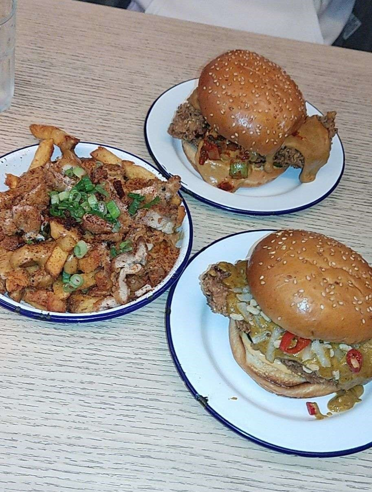

### Neon (8/10)
Good

### The Ramen Bar (8/10)
Good

### Zaytoon (8/10)
Nice persian restaurant with great food. I would recommend the lamb doner, bit awkward to eat though but still very nice.

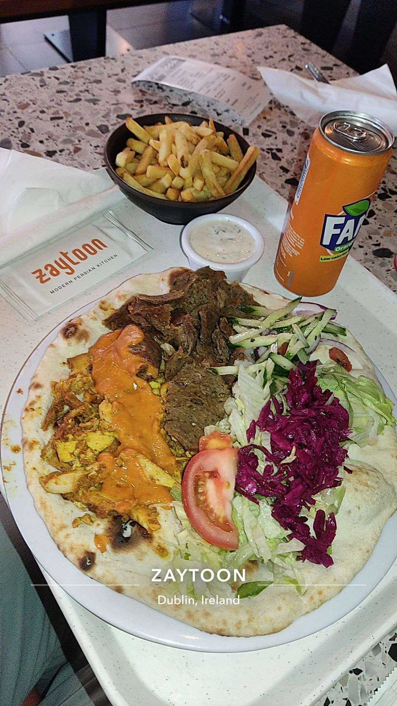

### Hot Chix by Ruby's (8.75/10)
very nice place, burgers are good and on Wednesdays its half price on food. Cheesecake is also good but isn't really a cheesecake.

### Takara ramen & deli sushi bar (7/10)
Honestly? Overrated. Food is good and place looks nice but I don't get why there's always a queue outside the place.

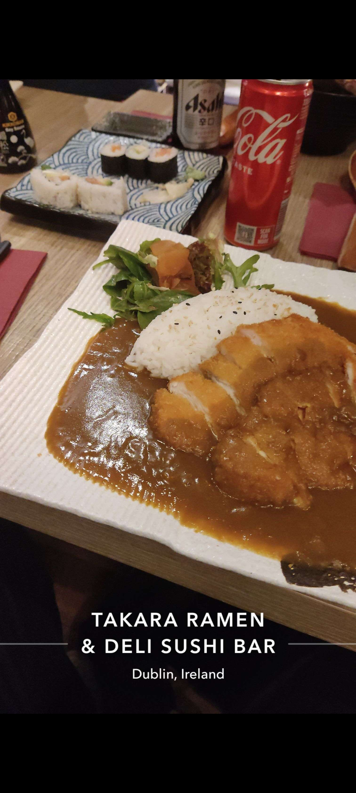

### Han Sung (8.1/10)
At the back of this asian store theres a nice korean restaurant that serves one of the most underrated food in town. The chicken mayo is very nice. The Only thing is the seating. The place feels a bit cramped and can be a bit of a struggle trying to find a place to sit. Not ideal if you're going in a big group.

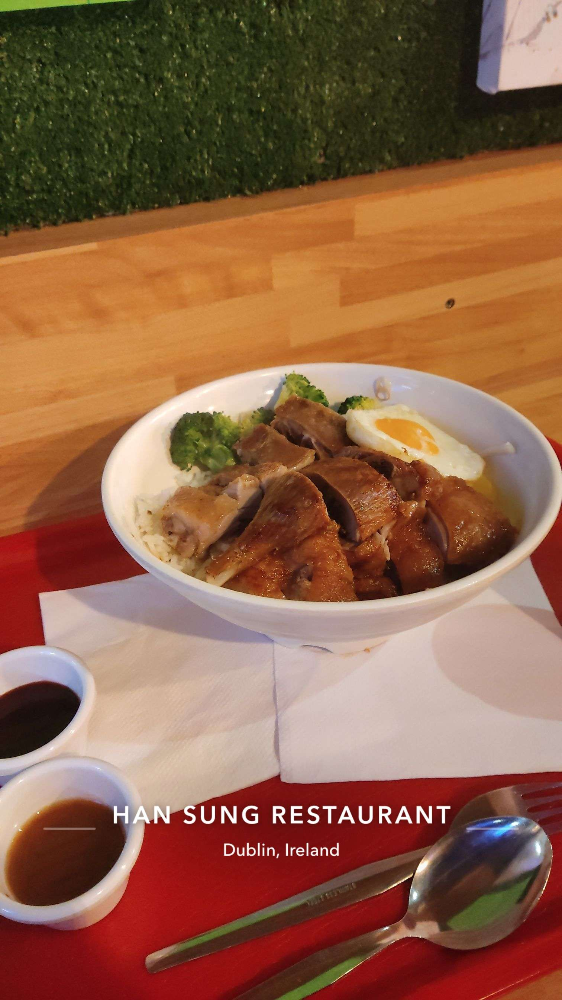

### White Rabbit (7.66/10)
Nice food, good for corn dogs. However there's like barely anywhere to sit/

### Roseland Chinese (6.9/10)
Big spice bag for the price and it's pretty good. Cash only though!

### Hannah BBQ (7.5/10)
Kebabs and wraps kinda place, basically a less boujee Zaytoon. The kebab is quite good and baklava was quite nice too. It's worth the price I would say if you're feeling a doner kebab and in the area.

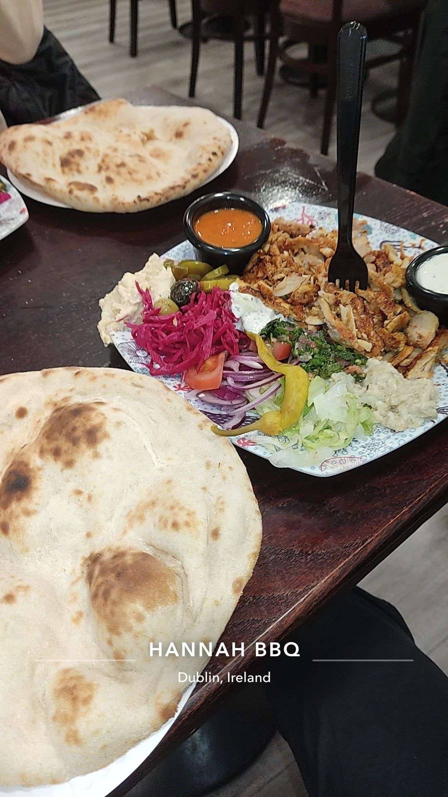

### Brewdog (6.6/10)
The venue is very nice, always seems busy. The food is good but overpriced tbh. There are better places out there.

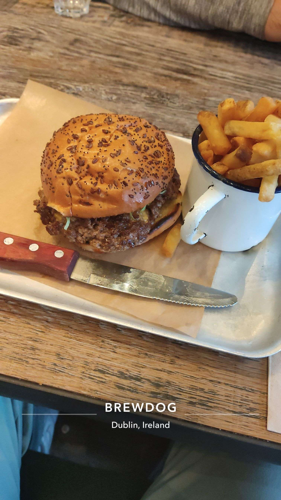

### Andhra Bhavan (8/10)
Nice south indian restaurant in town. Food was very nice and the place was a vibe. Food is a bit spicy though so yeah. The indian chicken 65 was very nice.

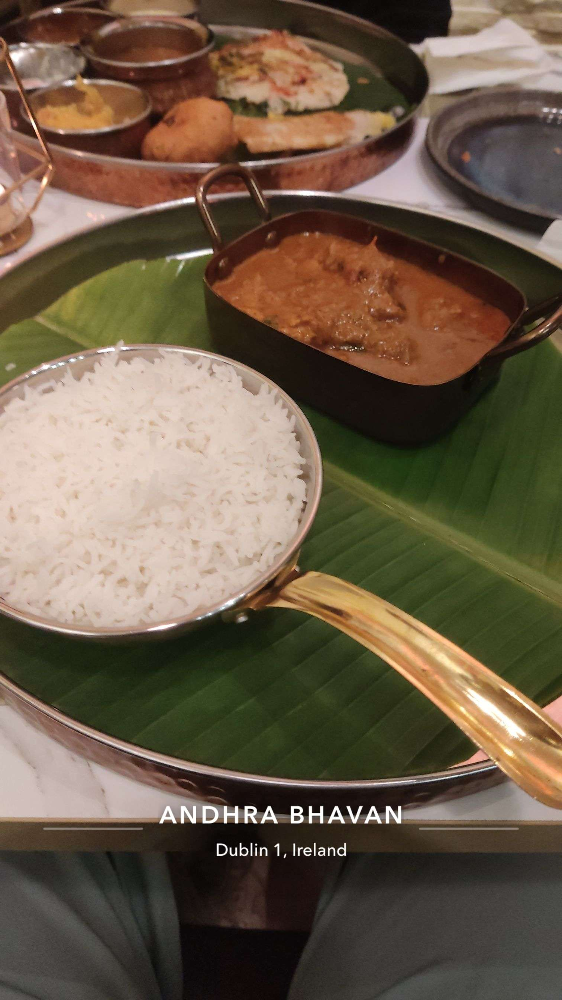

### Cinnamon Garden Restaurant (8/10)
If you're in Ashbourne and want some indian food, you need to try this place. Food is very good and the venue is very nice.

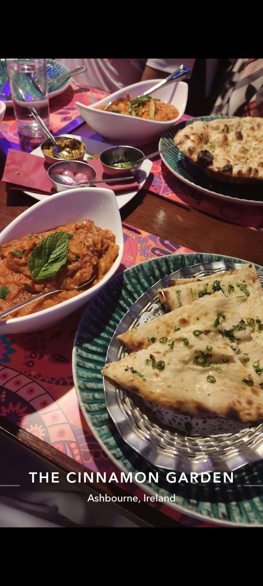

### El siliencio

### The Rolling Stove at Pillar Bar

### Masa

### Terra madre

### Zing

### Silver Leaf

### Aperitivo

### Hang dai

### Pi

### Shouk

### BIGFAN

### Padoca

### Mad Yolks

### Drunken Fish

### Declan & Donal's Deli

### Kasi Cafe
